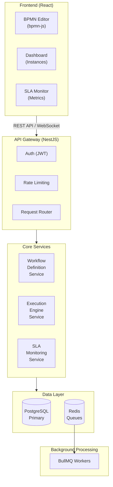
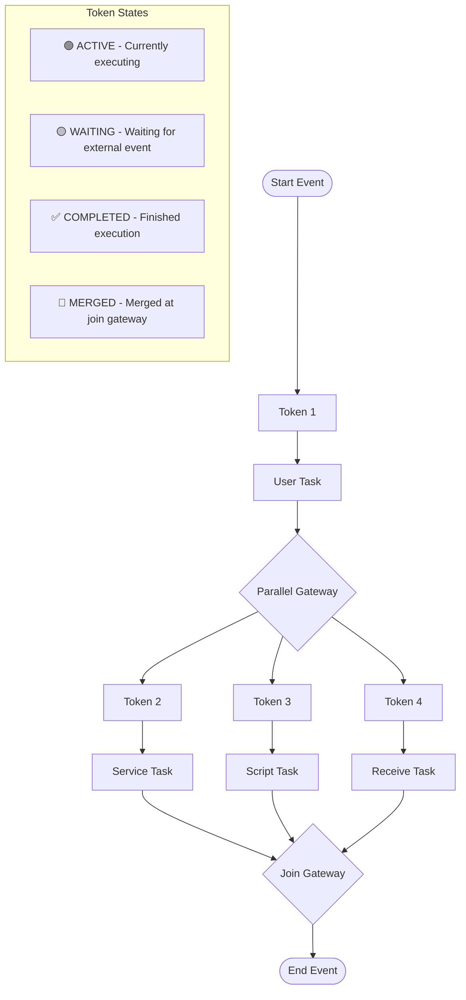
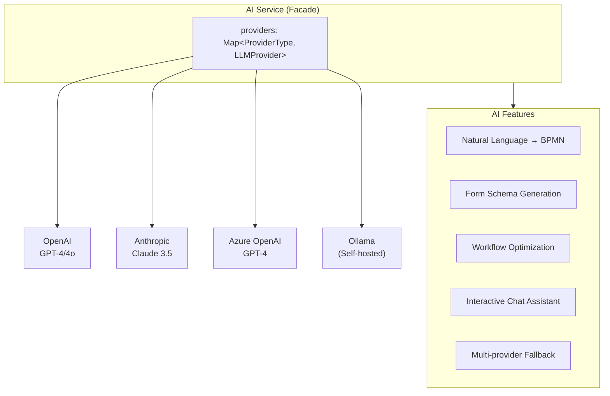

# Architecture Overview

## System Architecture

FlowEngine follows a microservices-inspired architecture with clear separation of concerns, designed for horizontal scalability and high availability.

```
┌─────────────────────────────────────────────────────────────────────────────┐
│                              FRONTEND (React)                                │
│  ┌─────────────────┐  ┌─────────────────┐  ┌─────────────────┐              │
│  │  BPMN Editor    │  │  Dashboard      │  │  SLA Monitor    │              │
│  │  (bpmn-js)      │  │  (Instances)    │  │  (Metrics)      │              │
│  └─────────────────┘  └─────────────────┘  └─────────────────┘              │
└────────────────────────────────┬────────────────────────────────────────────┘
                                 │ REST API / WebSocket
┌────────────────────────────────┼────────────────────────────────────────────┐
│                          API GATEWAY (NestJS)                                │
│  ┌─────────────────┐  ┌─────────────────┐  ┌─────────────────┐              │
│  │  Auth (JWT)     │  │  Rate Limiting  │  │  Request Router │              │
│  └─────────────────┘  └─────────────────┘  └─────────────────┘              │
└────────────────────────────────┬────────────────────────────────────────────┘
                                 │
     ┌───────────────────────────┼───────────────────────────┐
     │                           │                           │
     ▼                           ▼                           ▼
┌──────────────┐         ┌──────────────┐         ┌──────────────┐
│  Workflow    │         │  Execution   │         │  SLA         │
│  Definition  │         │  Engine      │         │  Monitoring  │
│  Service     │         │  Service     │         │  Service     │
└──────────────┘         └──────────────┘         └──────────────┘
     │                           │                           │
     └───────────────────────────┼───────────────────────────┘
                                 │
                    ┌────────────┴────────────┐
                    ▼                         ▼
            ┌──────────────┐         ┌──────────────┐
            │  PostgreSQL  │         │    Redis     │
            │  (Primary)   │         │  (Queues)    │
            └──────────────┘         └──────────────┘
                                           │
                                    ┌──────┴──────┐
                                    │   BullMQ    │
                                    │   Workers   │
                                    └─────────────┘
```

<details>
<summary>📊 View as Mermaid Diagram (click to expand)</summary>



</details>

## Core Components

### 1. API Gateway

The entry point for all client requests. Handles:
- **Authentication**: JWT-based token validation
- **Authorization**: Role-based access control
- **Rate Limiting**: Protects against abuse (`@nestjs/throttler`)
- **Request Routing**: Directs requests to appropriate services

### 2. Workflow Definition Service

Manages workflow templates and their lifecycle:
- CRUD operations for workflow definitions
- BPMN 2.0 XML parsing and validation
- Version control with draft/published/archived states
- Activity and transition management
- SLA definition configuration

### 3. Execution Engine Service

The heart of the workflow engine:
- Workflow instance lifecycle management
- Token-based execution model for parallel flows
- Gateway evaluation (exclusive, parallel, inclusive)
- Task creation and state transitions
- Variable scope management

> **Detailed Documentation**: See [Task Execution Mechanics](./task-execution.md) for comprehensive internal execution details.

#### Task Executor Architecture

```
┌─────────────────────────────────────────────────────────────────────────────┐
│                         TASK EXECUTOR REGISTRY                               │
├─────────────────────────────────────────────────────────────────────────────┤
│                                                                              │
│  ┌─────────────────────────────────────────────────────────────────────────┐│
│  │                        TaskExecutorRegistry                              ││
│  │  ┌─────────────────────────────────────────────────────────────────┐    ││
│  │  │  handlers: Map<ActivityType, TaskHandler>                        │    ││
│  │  │                                                                  │    ││
│  │  │  • userTask        → UserTaskHandler                             │    ││
│  │  │  • serviceTask     → ServiceTaskHandler                          │    ││
│  │  │  • scriptTask      → ScriptTaskHandler                           │    ││
│  │  │  • businessRuleTask → BusinessRuleTaskHandler                    │    ││
│  │  │  • sendTask        → SendTaskHandler                             │    ││
│  │  │  • receiveTask     → ReceiveTaskHandler                          │    ││
│  │  │  • manualTask      → ManualTaskHandler                           │    ││
│  │  └─────────────────────────────────────────────────────────────────┘    ││
│  └─────────────────────────────────────────────────────────────────────────┘│
│                                                                              │
│  Execution Flow:                                                             │
│  1. Token arrives at activity                                               │
│  2. Registry looks up handler by ActivityType                               │
│  3. Handler executes with ExecutionContext                                  │
│  4. Returns ExecutionResult (completed/waiting/failed)                      │
│  5. Engine processes result and continues                                   │
│                                                                              │
└─────────────────────────────────────────────────────────────────────────────┘
```

#### Task Handler Interface

```typescript
interface TaskHandler {
  type: ActivityType;

  // Execute the task and return result
  execute(task: TaskInstance, context: ExecutionContext): Promise<ExecutionResult>;

  // Optional: Validate configuration at design time
  validate?(config: ActivityConfig): ValidationResult;

  // Optional: Handle task timeout
  onTimeout?(task: TaskInstance): Promise<void>;

  // Optional: Handle task cancellation
  onCancel?(task: TaskInstance): Promise<void>;
}

interface ExecutionContext {
  workflowInstance: WorkflowInstance;
  activityDefinition: ActivityDefinition;
  variables: Record<string, unknown>;
  services: ServiceContainer;
  logger: Logger;
  tracer: Tracer;
}

interface ExecutionResult {
  status: 'completed' | 'waiting' | 'failed';
  outputVariables?: Record<string, unknown>;
  error?: ExecutionError;
  waitCondition?: WaitCondition;
}
```

#### Task Type Execution Modes

| Task Type | Execution Mode | Wait Behavior | Completion Trigger |
|-----------|---------------|---------------|-------------------|
| User Task | Asynchronous | Waits for human | Form submission |
| Service Task | Synchronous | No wait | Immediate execution |
| Script Task | Synchronous | No wait | Script completion |
| Business Rule Task | Synchronous | No wait | Rule evaluation |
| Send Task | Sync/Async | Optional wait | Delivery confirmation |
| Receive Task | Asynchronous | Waits for external | Message correlation |
| Manual Task | Asynchronous | Waits for confirmation | User confirmation |

#### Execution Token Flow

```
┌─────────────────────────────────────────────────────────────────────────────┐
│                           TOKEN-BASED EXECUTION                              │
├─────────────────────────────────────────────────────────────────────────────┤
│                                                                              │
│  Start Event                                                                 │
│       │                                                                      │
│       ▼                                                                      │
│  ┌─────────┐                                                                │
│  │ Token 1 │ ─────────► User Task ─────────► Gateway                        │
│  └─────────┘                                    │                            │
│                                                 │                            │
│                              ┌──────────────────┼──────────────────┐        │
│                              │                  │                  │        │
│                              ▼                  ▼                  ▼        │
│                         ┌─────────┐       ┌─────────┐       ┌─────────┐    │
│                         │ Token 2 │       │ Token 3 │       │ Token 4 │    │
│                         └────┬────┘       └────┬────┘       └────┬────┘    │
│                              │                  │                  │        │
│                              ▼                  ▼                  ▼        │
│                         Service Task     Script Task     Receive Task      │
│                              │                  │                  │        │
│                              └──────────────────┼──────────────────┘        │
│                                                 │                            │
│                                                 ▼                            │
│                                            Join Gateway                      │
│                                          (waits for all)                    │
│                                                 │                            │
│                                                 ▼                            │
│                                            End Event                         │
│                                                                              │
│  Token States:                                                               │
│  • ACTIVE   - Currently executing                                           │
│  • WAITING  - Waiting for external event                                    │
│  • COMPLETED - Finished execution                                           │
│  • MERGED   - Merged at join gateway                                        │
│                                                                              │
└─────────────────────────────────────────────────────────────────────────────┘
```

<details>
<summary>📊 View as Mermaid Diagram (click to expand)</summary>



</details>

### 4. SLA Monitoring Service

Real-time SLA tracking and enforcement:
- Scheduled SLA checks via BullMQ
- Warning and breach detection
- Multi-level escalation handling
- Notification dispatch
- Metrics aggregation

### 5. AI Service Layer

AI-powered workflow design and assistance:

```
┌─────────────────────────────────────────────────────────────────────────────┐
│                           AI SERVICE ARCHITECTURE                            │
├─────────────────────────────────────────────────────────────────────────────┤
│                                                                              │
│  ┌─────────────────────────────────────────────────────────────────────────┐│
│  │                         AI Service (Facade)                              ││
│  │  ┌─────────────────────────────────────────────────────────────────┐    ││
│  │  │  providers: Map<ProviderType, LLMProvider>                       │    ││
│  │  │                                                                  │    ││
│  │  │  • openai       → OpenAIProvider                                 │    ││
│  │  │  • anthropic    → AnthropicProvider                              │    ││
│  │  │  • azure-openai → AzureOpenAIProvider                            │    ││
│  │  │  • ollama       → OllamaProvider (self-hosted)                   │    ││
│  │  └─────────────────────────────────────────────────────────────────┘    ││
│  └─────────────────────────────────────────────────────────────────────────┘│
│                                                                              │
│  Features:                                                                   │
│  • Natural Language → BPMN workflow generation                              │
│  • Form schema generation from descriptions                                  │
│  • Workflow optimization suggestions                                         │
│  • Interactive chat assistant for workflow design                            │
│  • Multi-provider fallback and load balancing                               │
│                                                                              │
└─────────────────────────────────────────────────────────────────────────────┘
```

<details>
<summary>📊 View as Mermaid Diagram (click to expand)</summary>



</details>

**AI Provider Interface:**
```typescript
interface LLMProvider {
  name: string;

  // Generate workflow from natural language
  generateWorkflow(prompt: string, options?: GenerationOptions): Promise<WorkflowDefinition>;

  // Generate form schema from description
  generateFormSchema(description: string): Promise<FormSchema>;

  // Analyze and optimize existing workflow
  analyzeWorkflow(workflow: WorkflowDefinition): Promise<OptimizationSuggestions>;

  // Interactive chat for workflow assistance
  chat(messages: ChatMessage[], context?: WorkflowContext): Promise<ChatResponse>;
}

interface GenerationOptions {
  complexity?: 'simple' | 'moderate' | 'complex';
  includeErrorHandling?: boolean;
  includeSLA?: boolean;
  style?: 'sequential' | 'parallel' | 'adaptive';
}
```

**Provider Configuration:**
```typescript
{
  "ai": {
    "defaultProvider": "anthropic",
    "providers": {
      "openai": {
        "apiKey": "${OPENAI_API_KEY}",
        "model": "gpt-4-turbo",
        "maxTokens": 4096
      },
      "anthropic": {
        "apiKey": "${ANTHROPIC_API_KEY}",
        "model": "claude-3-sonnet-20240229",
        "maxTokens": 4096
      },
      "ollama": {
        "baseUrl": "http://localhost:11434",
        "model": "llama3",
        "enabled": true
      }
    },
    "caching": {
      "enabled": true,
      "ttlSeconds": 3600
    },
    "rateLimiting": {
      "requestsPerMinute": 60,
      "tokensPerMinute": 100000
    }
  }
}
```

> **Detailed Documentation**: See [Integration Guide - AI Agent Integration](./integration-guide.md#ai-agent-integration) for comprehensive implementation details.

### 6. File Storage Service

Manages file uploads, storage, and retrieval:

```
┌─────────────────────────────────────────────────────────────────────────────┐
│                        FILE STORAGE ARCHITECTURE                             │
├─────────────────────────────────────────────────────────────────────────────┤
│                                                                              │
│  User Upload                                                                 │
│       │                                                                      │
│       ▼                                                                      │
│  ┌─────────────────┐                                                        │
│  │ Upload Handler  │                                                        │
│  │ • Validation    │                                                        │
│  │ • Size limits   │                                                        │
│  │ • Type checking │                                                        │
│  └────────┬────────┘                                                        │
│           │                                                                  │
│           ▼                                                                  │
│  ┌─────────────────┐      ┌─────────────────┐                               │
│  │ Virus Scanner   │─────►│ Metadata        │                               │
│  │ (ClamAV)        │      │ Extractor       │                               │
│  └────────┬────────┘      └────────┬────────┘                               │
│           │                        │                                         │
│           └────────────┬───────────┘                                         │
│                        ▼                                                     │
│  ┌─────────────────────────────────────────────────────────────────────────┐│
│  │                    Storage Provider Router                               ││
│  │  ┌──────────┐  ┌──────────┐  ┌──────────┐  ┌──────────┐  ┌──────────┐  ││
│  │  │   S3     │  │  Azure   │  │   GCS    │  │  MinIO   │  │  Local   │  ││
│  │  │          │  │  Blob    │  │          │  │          │  │  FS      │  ││
│  │  └──────────┘  └──────────┘  └──────────┘  └──────────┘  └──────────┘  ││
│  └─────────────────────────────────────────────────────────────────────────┘│
│                                                                              │
└─────────────────────────────────────────────────────────────────────────────┘
```

**Storage Provider Interface:**
```typescript
interface StorageProvider {
  name: string;

  // Upload file and return storage reference
  upload(file: Buffer, metadata: FileMetadata): Promise<StorageReference>;

  // Download file by reference
  download(reference: StorageReference): Promise<Buffer>;

  // Generate temporary access URL
  getSignedUrl(reference: StorageReference, expiresIn: number): Promise<string>;

  // Delete file
  delete(reference: StorageReference): Promise<void>;
}

interface FileMetadata {
  filename: string;
  mimeType: string;
  size: number;
  tenantId: string;
  taskId?: string;
  uploadedBy: string;
  tags?: Record<string, string>;
}

interface StorageReference {
  provider: string;
  bucket: string;
  key: string;
  version?: string;
}
```

**Storage Configuration:**
```typescript
{
  "storage": {
    "provider": "s3",
    "providers": {
      "s3": {
        "bucket": "flowengine-uploads",
        "region": "us-east-1",
        "accessKeyId": "${AWS_ACCESS_KEY_ID}",
        "secretAccessKey": "${AWS_SECRET_ACCESS_KEY}"
      },
      "azure": {
        "accountName": "flowenginestorage",
        "accountKey": "${AZURE_STORAGE_KEY}",
        "containerName": "uploads"
      },
      "local": {
        "basePath": "/var/flowengine/uploads",
        "maxSizeBytes": 104857600
      }
    },
    "validation": {
      "maxFileSize": "50MB",
      "allowedTypes": ["image/*", "application/pdf", "text/*"],
      "virusScan": true
    },
    "thumbnails": {
      "enabled": true,
      "sizes": [100, 300, 600]
    }
  }
}
```

**File Processing Pipeline:**
1. **Upload Validation**: Check file size, type, and naming
2. **Virus Scanning**: ClamAV integration for malware detection
3. **Metadata Extraction**: EXIF for images, properties for documents
4. **Thumbnail Generation**: Automatic thumbnails for images
5. **Storage**: Route to configured provider
6. **Database Record**: Store reference and metadata

> **Detailed Documentation**: See [BPMN Support - File Upload Fields](./bpmn-support.md#file-upload-fields) for form integration details.

## Data Flow

### Starting a Workflow

```
1. Client → POST /api/v1/instances
2. API validates request and workflow definition
3. Creates workflow_instance record (status: running)
4. Creates initial execution_token at start event
5. Enqueues 'CONTINUE_EXECUTION' job to BullMQ
6. Returns instance ID to client

Background:
7. Worker picks up job
8. Evaluates start event → creates task for first activity
9. If user task: waits for completion
   If service task: executes and continues
10. Process continues until end event reached
```

### Completing a Task

```
1. Client → POST /api/v1/tasks/:id/complete
2. API validates task ownership and status
3. Updates task_instance (status: completed)
4. Records state change in task_state_history
5. Cancels any scheduled SLA jobs for this task
6. Enqueues 'CONTINUE_EXECUTION' job
7. Returns success to client

Background:
8. Worker evaluates next activities
9. For exclusive gateway: evaluates conditions
   For parallel gateway: forks execution tokens
10. Creates next task(s) and schedules their SLAs
```

### SLA Monitoring Flow

```
1. Task created → SLA service schedules monitoring jobs
2. At warning threshold: CHECK_SLA job fires
   - If task still active → create warning event, notify
3. At breach threshold: CHECK_SLA job fires
   - If task still active → create breach event, notify
4. Escalation rules trigger sequentially after breach
5. Task completed → all scheduled jobs cancelled
```

## Event-Driven Architecture

### Event Bus (Redis Streams)

Events flow through dedicated channels:

| Channel | Events |
|---------|--------|
| `workflow.*` | WORKFLOW_STARTED, WORKFLOW_COMPLETED, WORKFLOW_FAILED |
| `task.*` | TASK_CREATED, TASK_ASSIGNED, TASK_COMPLETED |
| `sla.*` | SLA_WARNING, SLA_BREACH, ESCALATION |
| `notification.*` | EMAIL_SENT, SLACK_SENT, WEBHOOK_CALLED |

### BullMQ Queues

| Queue | Purpose | Concurrency |
|-------|---------|-------------|
| `workflow-execution` | Main execution jobs | 10 |
| `task-processing` | Service task execution | 20 |
| `sla-monitoring` | SLA checks and escalations | 20 |
| `notifications` | Notification dispatch | 10 |
| `timers` | Scheduled/delayed activities | 5 |

## Scalability Considerations

### Horizontal Scaling

- **API Servers**: Stateless, can scale behind load balancer
- **Workers**: Multiple instances with Redis-based job distribution
- **Database**: Read replicas for query load distribution

### Distributed Locking

Critical sections use Redlock:
- Parallel gateway synchronization (token merging)
- Task claim operations
- Instance state transitions

**Lock key patterns:**

| Operation | Lock Key Pattern | TTL |
|-----------|-----------------|-----|
| Gateway merge | `gateway:{instanceId}:{gatewayId}` | 5s |
| Task claim | `task:claim:{taskId}` | 3s |
| State transition | `instance:state:{instanceId}` | 5s |

### Caching Strategy

| Data | Cache | TTL |
|------|-------|-----|
| Workflow definitions | Redis | 5 min |
| User sessions | Redis | 24 hours |
| SLA metrics | Redis | 1 min |

## Multi-Tenancy Architecture

FlowEngine supports multi-tenancy with complete data isolation between organizations.

### Tenant Isolation Model

```
┌─────────────────────────────────────────────────────────────────┐
│                        Shared Infrastructure                     │
│  ┌─────────────┐  ┌─────────────┐  ┌─────────────┐              │
│  │   API       │  │  Workers    │  │  Database   │              │
│  │  Servers    │  │  Pool       │  │  Cluster    │              │
│  └─────────────┘  └─────────────┘  └─────────────┘              │
└─────────────────────────────────────────────────────────────────┘
                              │
              ┌───────────────┼───────────────┐
              ▼               ▼               ▼
        ┌──────────┐   ┌──────────┐   ┌──────────┐
        │ Tenant A │   │ Tenant B │   │ Tenant C │
        │ (Acme)   │   │ (Globex) │   │ (Initech)│
        ├──────────┤   ├──────────┤   ├──────────┤
        │ Users    │   │ Users    │   │ Users    │
        │ Workflows│   │ Workflows│   │ Workflows│
        │ Instances│   │ Instances│   │ Instances│
        └──────────┘   └──────────┘   └──────────┘
```

**Isolation Mechanisms:**
- **Row-Level Security (RLS)**: PostgreSQL policies enforce tenant boundaries
- **Tenant Context**: Set via `app.current_tenant` session variable
- **API Middleware**: Validates tenant access on every request
- **Queue Isolation**: Jobs tagged with tenant ID for proper routing

### Tenant Resolution

```
1. User authenticates → JWT contains tenant_id claim
2. API Gateway extracts tenant from JWT
3. Middleware sets PostgreSQL session: SET app.current_tenant = 'uuid'
4. RLS policies automatically filter all queries
5. Response only contains tenant's data
```

### Cross-Tenant Operations

For platform admins:
- Use service accounts with RLS bypass
- Audit logging for all cross-tenant access
- Separate admin API endpoints

---

## Security Architecture

### Authentication Providers

FlowEngine supports multiple authentication methods per tenant:

```
┌─────────────────────────────────────────────────────────────────┐
│                      Auth Provider Router                        │
│                                                                  │
│  ┌──────────┐  ┌──────────┐  ┌──────────┐  ┌──────────┐        │
│  │  Local   │  │   LDAP   │  │ Keycloak │  │  SAML    │        │
│  │(Username)│  │ (AD/389) │  │ (OIDC)   │  │  (SSO)   │        │
│  └──────────┘  └──────────┘  └──────────┘  └──────────┘        │
└─────────────────────────────────────────────────────────────────┘
```

#### Local Authentication
- Username/password with bcrypt hashing
- Configurable password policies
- Email verification support
- Account lockout after failed attempts

#### LDAP / Active Directory

```
┌─────────────┐      ┌─────────────┐      ┌─────────────┐
│  FlowEngine │ ───► │    LDAP     │ ───► │  AD Server  │
│     API     │      │   Service   │      │             │
└─────────────┘      └─────────────┘      └─────────────┘
                            │
                     ┌──────┴──────┐
                     │  Features   │
                     ├─────────────┤
                     │ • Bind auth │
                     │ • User sync │
                     │ • Group sync│
                     │ • StartTLS  │
                     └─────────────┘
```

**LDAP Flow:**
1. User enters LDAP credentials
2. FlowEngine binds to LDAP with service account
3. Search for user by username filter
4. Attempt bind with user's DN and password
5. On success, fetch user attributes and groups
6. Create/update local user record
7. Issue FlowEngine JWT

**Configuration:**
```typescript
{
  url: "ldap://ldap.company.com:389",
  baseDn: "dc=company,dc=com",
  bindDn: "cn=service,ou=apps,dc=company,dc=com",
  userSearchBase: "ou=users",
  userSearchFilter: "(sAMAccountName={{username}})",
  groupSearchBase: "ou=groups",
  groupSearchFilter: "(member={{dn}})",
  startTls: true,
  syncInterval: 3600  // Sync users/groups every hour
}
```

#### Keycloak (OIDC)

```
┌─────────────┐      ┌─────────────┐      ┌─────────────┐
│   Browser   │ ───► │  Keycloak   │ ───► │  FlowEngine │
│             │ ◄─── │   Server    │ ◄─── │     API     │
└─────────────┘      └─────────────┘      └─────────────┘
      │                     │                    │
      │  1. Redirect        │                    │
      │─────────────────────►                    │
      │                     │                    │
      │  2. Login UI        │                    │
      │◄────────────────────│                    │
      │                     │                    │
      │  3. Auth Code       │                    │
      │─────────────────────►                    │
      │                     │  4. Exchange Code  │
      │                     │◄───────────────────│
      │                     │  5. Tokens         │
      │                     │────────────────────►
      │  6. JWT (FlowEngine)│                    │
      │◄────────────────────────────────────────│
```

**Keycloak Features:**
- Single Sign-On (SSO) across applications
- Role mapping from Keycloak to FlowEngine
- User/group federation from Keycloak
- Token refresh handling
- Logout propagation

**Configuration:**
```typescript
{
  serverUrl: "https://keycloak.company.com",
  realm: "company",
  clientId: "flowengine",
  clientSecret: "secret",
  syncRoles: true,
  roleMapping: {
    "realm-admin": "admin",
    "workflow-designer": "designer",
    "workflow-operator": "operator"
  }
}
```

#### OAuth2 / OIDC (Generic)

Supports any OAuth2/OIDC compliant provider:
- Google Workspace
- Microsoft Entra ID (Azure AD)
- Okta
- Auth0
- GitHub (OAuth2)

#### SAML 2.0

For enterprise SSO with SAML identity providers:
- Service Provider (SP) initiated flow
- Signed assertions
- Attribute mapping
- Single Logout (SLO)

### Authentication Flow

```
┌─────────────────────────────────────────────────────────────────┐
│                     Authentication Flow                          │
├─────────────────────────────────────────────────────────────────┤
│                                                                  │
│  1. User accesses FlowEngine                                    │
│                    │                                             │
│                    ▼                                             │
│  2. Tenant identified (subdomain/path/header)                   │
│                    │                                             │
│                    ▼                                             │
│  3. Fetch tenant's auth providers                               │
│                    │                                             │
│         ┌─────────┼─────────┐                                   │
│         ▼         ▼         ▼                                   │
│     [Local]   [LDAP]   [Keycloak]                               │
│         │         │         │                                   │
│         └─────────┼─────────┘                                   │
│                   ▼                                             │
│  4. User selects provider / auto-redirect                       │
│                   │                                             │
│                   ▼                                             │
│  5. Provider-specific authentication                            │
│                   │                                             │
│                   ▼                                             │
│  6. Create/update user in FlowEngine                            │
│                   │                                             │
│                   ▼                                             │
│  7. Issue FlowEngine JWT with tenant_id                         │
│                   │                                             │
│                   ▼                                             │
│  8. Redirect to application                                     │
│                                                                  │
└─────────────────────────────────────────────────────────────────┘
```

### JWT Token Structure

```json
{
  "sub": "user-uuid",
  "email": "user@company.com",
  "name": "John Doe",
  "tenant_id": "tenant-uuid",
  "tenant_slug": "acme",
  "role": "designer",
  "permissions": ["workflows:create", "workflows:publish"],
  "auth_provider": "keycloak",
  "groups": ["engineering", "approvers"],
  "iat": 1704067200,
  "exp": 1704070800
}
```

### Authorization Model

- **Roles**: Owner, Admin, Designer, Operator, Viewer
- **Permissions**: Fine-grained per-resource (workflow, instance, task)
- **Task Assignment**: User-based or group-based
- **Tenant Membership**: Users can belong to multiple tenants with different roles

## Reliability & Fault Tolerance

FlowEngine is designed for enterprise-grade reliability with multiple layers of fault tolerance.

### Workflow Versioning & Migration

```
┌─────────────────────────────────────────────────────────────────┐
│                    Workflow Version Lifecycle                     │
├─────────────────────────────────────────────────────────────────┤
│                                                                  │
│  Draft v3 ──────► Published v3 ──────► Archived v3              │
│       ▲                 │                                        │
│       │                 │ New instances                          │
│       │                 ▼                                        │
│  ┌─────────┐      ┌─────────────────┐                           │
│  │ Editor  │      │ Running on v3   │                           │
│  └─────────┘      └─────────────────┘                           │
│                                                                  │
│  Existing instances continue on their original version          │
│  Migration supported with compatibility checks                   │
│                                                                  │
└─────────────────────────────────────────────────────────────────┘
```

**Version Control Features:**
- Semantic versioning for workflow definitions
- Draft → Published → Archived state machine
- Running instances locked to their creation version
- Optional migration paths between compatible versions
- Rollback capability to previous versions

**Migration Strategies:**
```typescript
interface MigrationStrategy {
  type: 'complete_on_old' | 'migrate_to_new' | 'abort_and_restart';
  compatibilityCheck: boolean;
  variableMapping?: Record<string, string>;
  activityMapping?: Record<string, string>;
}
```

### Compensation & Rollback Handlers

Implements the Saga pattern for distributed transaction management:

```
┌─────────────────────────────────────────────────────────────────┐
│                       Saga Execution                             │
├─────────────────────────────────────────────────────────────────┤
│                                                                  │
│  Forward Flow:                                                   │
│  ┌──────┐    ┌──────┐    ┌──────┐    ┌──────┐                  │
│  │ T1 ✓ │───►│ T2 ✓ │───►│ T3 ✗ │    │ T4   │                  │
│  └──────┘    └──────┘    └──────┘    └──────┘                  │
│                              │                                   │
│                              │ Failure triggers rollback         │
│                              ▼                                   │
│  Compensation Flow:                                              │
│  ┌──────┐    ┌──────┐                                           │
│  │ C1 ◄ │◄───│ C2 ◄ │◄── Compensation handlers                  │
│  └──────┘    └──────┘                                           │
│                                                                  │
└─────────────────────────────────────────────────────────────────┘
```

**Compensation Handler Types:**
- **Script**: Inline JavaScript/TypeScript rollback logic
- **Service**: External HTTP endpoint for rollback
- **Workflow**: Trigger another workflow as compensation

```typescript
// Example: Service task with compensation
{
  activityId: "create-order",
  type: "serviceTask",
  config: {
    endpoint: "http://orders/api/create",
    method: "POST"
  },
  compensation: {
    type: "service",
    config: {
      endpoint: "http://orders/api/cancel",
      method: "POST",
      inputMapping: { orderId: "${result.orderId}" }
    }
  }
}
```

### Retry Policies & Dead Letter Queue

```
┌─────────────────────────────────────────────────────────────────┐
│                      Retry Flow                                  │
├─────────────────────────────────────────────────────────────────┤
│                                                                  │
│  Job Execution                                                   │
│       │                                                          │
│       ▼                                                          │
│  ┌─────────┐     Success     ┌─────────────┐                    │
│  │ Execute │────────────────►│  Complete   │                    │
│  └─────────┘                 └─────────────┘                    │
│       │                                                          │
│       │ Failure                                                  │
│       ▼                                                          │
│  ┌─────────────────┐                                            │
│  │ Retryable Error?│                                            │
│  └─────────────────┘                                            │
│       │         │                                                │
│      Yes        No                                               │
│       │         │                                                │
│       ▼         ▼                                                │
│  ┌─────────┐  ┌───────────────┐                                 │
│  │  Retry  │  │ Dead Letter   │                                 │
│  │ (backoff)│  │   Queue       │                                 │
│  └─────────┘  └───────────────┘                                 │
│       │              │                                           │
│       │ Max attempts │ Manual review                             │
│       └──────────────┘                                           │
│                                                                  │
└─────────────────────────────────────────────────────────────────┘
```

**Configurable Retry Policy:**
```typescript
interface RetryPolicy {
  maxAttempts: number;           // Default: 5
  backoffType: 'fixed' | 'exponential' | 'linear';
  initialDelay: number;          // ms, Default: 1000
  maxDelay: number;              // ms, Default: 60000
  multiplier: number;            // For exponential, Default: 2
  retryableErrors: string[];     // Error codes to retry
  nonRetryableErrors: string[];  // Error codes to fail immediately
}

// Example configuration
{
  "retryPolicy": {
    "maxAttempts": 5,
    "backoffType": "exponential",
    "initialDelay": 1000,
    "maxDelay": 60000,
    "retryableErrors": ["TIMEOUT", "SERVICE_UNAVAILABLE", "RATE_LIMITED"],
    "nonRetryableErrors": ["VALIDATION_ERROR", "NOT_FOUND", "UNAUTHORIZED"]
  }
}
```

**Dead Letter Queue Management:**
- Failed jobs moved to DLQ after max retries exhausted
- Admin UI for reviewing and reprocessing failed jobs
- Automatic alerting on DLQ threshold
- 30-day retention with configurable cleanup

### Checkpointing & Resume

For long-running workflows, periodic state snapshots enable recovery:

```
┌─────────────────────────────────────────────────────────────────┐
│                   Checkpoint Flow                                │
├─────────────────────────────────────────────────────────────────┤
│                                                                  │
│  Workflow Execution Timeline:                                    │
│                                                                  │
│  ──●────────●────────●────────●────────●────────►               │
│    │        │        │        │        │                        │
│   Start    CP1      CP2      CP3    Failure                     │
│                                        │                        │
│                                        │ Resume from CP3        │
│                                        ▼                        │
│  ─────────────────────────────●────────●────────●──►            │
│                               │        │        │               │
│                              CP3    Continue   End              │
│                                                                  │
└─────────────────────────────────────────────────────────────────┘
```

**Checkpoint Configuration:**
```typescript
interface CheckpointConfig {
  enabled: boolean;
  intervalSeconds: number;       // Create checkpoint every N seconds
  onActivityCompletion: boolean; // Checkpoint after each activity
  compressionEnabled: boolean;   // Compress checkpoint data
  maxCheckpoints: number;        // Keep last N checkpoints
}

// Default configuration
{
  "checkpointing": {
    "enabled": true,
    "intervalSeconds": 300,
    "onActivityCompletion": true,
    "compressionEnabled": true,
    "maxCheckpoints": 10
  }
}
```

**Checkpoint Contents:**
- Current execution state (active activities, tokens)
- Workflow variables snapshot
- Task states and assignments
- Timer/scheduler states

### Circuit Breaker Pattern

Protects external service integrations:

```
┌─────────────────────────────────────────────────────────────────┐
│                   Circuit Breaker States                         │
├─────────────────────────────────────────────────────────────────┤
│                                                                  │
│            Success                  Timeout                      │
│         ┌─────────┐            ┌─────────────┐                  │
│         │         │            │             │                  │
│         ▼         │            ▼             │                  │
│    ┌─────────┐    │      ┌───────────┐      │                  │
│    │ CLOSED  │────┴─────►│ HALF-OPEN │◄─────┴───────┐          │
│    └─────────┘ Failure   └───────────┘              │          │
│         │      threshold       │                    │          │
│         │                      │ Test request       │          │
│         │                      ▼                    │          │
│         │               ┌──────────────┐           │          │
│         └──────────────►│    OPEN      │───────────┘          │
│           Failure       └──────────────┘  Reset               │
│           threshold        (Fast fail)   timeout              │
│                                                                  │
└─────────────────────────────────────────────────────────────────┘
```

```typescript
interface CircuitBreakerConfig {
  failureThreshold: number;     // Failures before opening, Default: 5
  successThreshold: number;     // Successes to close, Default: 3
  timeout: number;              // Reset timeout ms, Default: 30000
  volumeThreshold: number;      // Min requests to evaluate
}
```

### Health Checks

Comprehensive health monitoring:

| Endpoint | Purpose | Response |
|----------|---------|----------|
| `/health` | Overall service health | `{ status: 'healthy' }` |
| `/health/ready` | Readiness probe (K8s) | `{ ready: true }` |
| `/health/live` | Liveness probe (K8s) | `{ alive: true }` |
| `/health/db` | Database connectivity | `{ status: 'up', latency: 5 }` |
| `/health/redis` | Redis connectivity | `{ status: 'up', latency: 2 }` |
| `/health/workers` | Worker pool status | `{ active: 5, idle: 3 }` |
| `/health/detailed` | Full system status | All components |

### Transaction Reconciliation

FlowEngine includes a reconciliation subsystem that detects and resolves inconsistencies between internal workflow state and external system state, ensuring data integrity across distributed operations.

```
┌─────────────────────────────────────────────────────────────────────┐
│                   Transaction Reconciliation                          │
├─────────────────────────────────────────────────────────────────────┤
│                                                                      │
│  Scheduled Reconciliation Job (configurable interval)                │
│         │                                                            │
│         ▼                                                            │
│  ┌──────────────────┐                                                │
│  │ Scan Pending      │──── Find activities in "executing" state      │
│  │ Transactions      │     longer than expected duration              │
│  └────────┬─────────┘                                                │
│           │                                                          │
│           ▼                                                          │
│  ┌──────────────────┐     ┌──────────────────────┐                   │
│  │ Query External   │────►│ Compare States       │                   │
│  │ System Status    │     │ Internal vs External │                   │
│  └──────────────────┘     └────────┬─────────────┘                   │
│                                    │                                 │
│                    ┌───────────────┼───────────────┐                 │
│                    │               │               │                 │
│                    ▼               ▼               ▼                 │
│              ┌──────────┐   ┌───────────┐   ┌───────────┐           │
│              │ MATCH    │   │ MISMATCH  │   │ UNKNOWN   │           │
│              │ (No-op)  │   │ (Resolve) │   │ (Alert)   │           │
│              └──────────┘   └─────┬─────┘   └───────────┘           │
│                                   │                                  │
│                        ┌──────────┼──────────┐                      │
│                        │                     │                      │
│                        ▼                     ▼                      │
│                 ┌─────────────┐       ┌─────────────┐               │
│                 │ External    │       │ Internal    │               │
│                 │ Succeeded   │       │ Succeeded   │               │
│                 │ (Catch Up)  │       │ (Compensate)│               │
│                 └─────────────┘       └─────────────┘               │
│                                                                      │
└─────────────────────────────────────────────────────────────────────┘
```

**Reconciliation Scenarios:**

| Scenario | Internal State | External State | Resolution |
|----------|---------------|----------------|------------|
| Lost acknowledgement | `executing` | Completed | Mark activity completed; advance workflow with external result |
| Phantom completion | `completed` | Not found / Failed | Trigger compensation handler; revert workflow state |
| Timeout with external success | `failed` (timeout) | Completed | Override failure; advance workflow with external result |
| Partial completion | `executing` | Partial | Wait for external completion; extend timeout |
| Duplicate execution | `completed` | Executed twice | Deduplicate; keep first result; log duplicate for audit |

**Reconciliation Configuration:**

```typescript
interface ReconciliationConfig {
  enabled: boolean;
  intervalSeconds: number;          // How often to run reconciliation (default: 300)
  staleTxThresholdSeconds: number;  // Age before a transaction is considered stale (default: 600)
  maxBatchSize: number;             // Max transactions to reconcile per cycle (default: 100)
  externalCheckTimeout: number;     // Timeout for querying external systems (default: 10000ms)
  autoResolve: boolean;             // Automatically resolve mismatches or require admin approval
  alertOnMismatch: boolean;         // Emit alert events on detected mismatches
  retentionDays: number;            // How long to keep reconciliation audit logs (default: 90)
}
```

**Reconciliation Audit Log:**

Every reconciliation action is logged for traceability:

| Field | Description |
|-------|-------------|
| `reconciliationId` | Unique ID for this reconciliation run |
| `activityInstanceId` | The activity that was reconciled |
| `workflowInstanceId` | Parent workflow instance |
| `internalState` | State in FlowEngine before reconciliation |
| `externalState` | State detected in external system |
| `resolution` | Action taken (`catch_up`, `compensate`, `alert`, `no_action`) |
| `resolvedAt` | Timestamp of resolution |
| `resolvedBy` | `system` (auto) or admin user ID (manual) |

### Workflow Self-Healing

FlowEngine continuously monitors workflow health and automatically recovers from anomalous states without manual intervention.

```
┌─────────────────────────────────────────────────────────────────────┐
│                      Self-Healing Engine                              │
├─────────────────────────────────────────────────────────────────────┤
│                                                                      │
│  ┌──────────────────────────────────────────────────────────┐        │
│  │                 Health Monitor                            │        │
│  │  Runs every {monitorIntervalSeconds} seconds             │        │
│  └──────────────┬───────────────────────────────────────────┘        │
│                 │                                                    │
│       ┌─────────┼─────────┬─────────────┬──────────────┐            │
│       │         │         │             │              │            │
│       ▼         ▼         ▼             ▼              ▼            │
│  ┌─────────┐ ┌────────┐ ┌──────────┐ ┌──────────┐ ┌──────────┐    │
│  │ Stuck   │ │Orphaned│ │ Stale    │ │ Deadlock │ │ Zombie   │    │
│  │Instance │ │ Token  │ │ Timer    │ │ Gateway  │ │ Worker   │    │
│  │Detector │ │Detector│ │ Detector │ │ Detector │ │ Detector │    │
│  └────┬────┘ └───┬────┘ └─────┬────┘ └─────┬────┘ └─────┬────┘    │
│       │          │            │             │            │          │
│       ▼          ▼            ▼             ▼            ▼          │
│  ┌─────────────────────────────────────────────────────────────┐    │
│  │                    Healing Actions                          │    │
│  │  • Resume stuck instances from last checkpoint             │    │
│  │  • Terminate orphaned tokens                               │    │
│  │  • Re-fire missed timer events                             │    │
│  │  • Force-merge deadlocked gateways                         │    │
│  │  • Reclaim jobs from zombie workers                        │    │
│  └─────────────────────────────────────────────────────────────┘    │
│                          │                                          │
│                          ▼                                          │
│  ┌─────────────────────────────────────────────────────────────┐    │
│  │                   Healing Audit Log                         │    │
│  │  Every action logged with before/after state for review    │    │
│  └─────────────────────────────────────────────────────────────┘    │
│                                                                      │
└─────────────────────────────────────────────────────────────────────┘
```

**Anomaly Detectors:**

| Detector | What It Finds | Detection Rule | Healing Action |
|----------|--------------|----------------|----------------|
| **Stuck Instance** | Workflow with no progress | Active instance with no state change for > `stuckThresholdMinutes` | Resume from last checkpoint; if no checkpoint, alert admin |
| **Orphaned Token** | Token not attached to any active path | Token references non-existent or completed activity | Terminate token; log for audit |
| **Stale Timer** | Timer event that should have fired | Timer `fireAt` is in the past by > `staleTimerThresholdMinutes` | Re-enqueue timer job; fire immediately if past due |
| **Deadlocked Gateway** | Parallel merge waiting for tokens that will never arrive | Merge gateway waiting > `gatewayTimeoutMinutes` with some branches in terminal state | Force-merge with available tokens; mark missing branches as skipped |
| **Zombie Worker** | Worker that holds job locks but has crashed | Worker heartbeat missing for > `workerTimeoutSeconds` | Release job locks; re-enqueue jobs to available workers |
| **Abandoned Task** | User task with no activity | Active task with no user interaction for > `abandonedTaskDays` | Reassign to fallback assignee or escalate to manager |

**Self-Healing Configuration:**

```typescript
interface SelfHealingConfig {
  enabled: boolean;
  monitorIntervalSeconds: number;       // Health check frequency (default: 60)

  stuckInstance: {
    enabled: boolean;
    thresholdMinutes: number;            // No progress for N minutes (default: 60)
    action: 'resume' | 'alert' | 'cancel';
    maxAutoResumeAttempts: number;       // Max times to auto-resume before alerting (default: 3)
  };

  orphanedToken: {
    enabled: boolean;
    cleanupIntervalMinutes: number;      // How often to scan (default: 15)
    action: 'terminate' | 'alert';
  };

  staleTimer: {
    enabled: boolean;
    thresholdMinutes: number;            // Past-due threshold (default: 5)
    action: 'refire' | 'alert';
  };

  deadlockedGateway: {
    enabled: boolean;
    timeoutMinutes: number;              // Merge wait timeout (default: 120)
    action: 'force_merge' | 'alert' | 'cancel';
  };

  zombieWorker: {
    enabled: boolean;
    heartbeatTimeoutSeconds: number;     // Missing heartbeat threshold (default: 60)
    action: 'reclaim' | 'alert';
  };

  abandonedTask: {
    enabled: boolean;
    thresholdDays: number;               // No interaction threshold (default: 7)
    action: 'reassign' | 'escalate' | 'alert';
    fallbackAssignee: string;            // User or group ID for reassignment
  };
}
```

**Healing Event Types:**

| Event | Payload | Emitted When |
|-------|---------|-------------|
| `healing.stuck_instance_resumed` | `{ instanceId, checkpointId, resumeAttempt }` | Stuck instance resumed from checkpoint |
| `healing.orphaned_token_terminated` | `{ tokenId, instanceId, activityId }` | Orphaned token cleaned up |
| `healing.stale_timer_refired` | `{ timerId, instanceId, originalFireAt, refiredAt }` | Past-due timer re-enqueued |
| `healing.gateway_force_merged` | `{ gatewayId, instanceId, receivedTokens, expectedTokens }` | Deadlocked gateway force-merged |
| `healing.zombie_worker_reclaimed` | `{ workerId, jobCount, reclaimedAt }` | Jobs reclaimed from dead worker |
| `healing.task_reassigned` | `{ taskId, fromUser, toUser, reason }` | Abandoned task reassigned |
| `healing.action_failed` | `{ detector, instanceId, error }` | Self-healing action itself failed |

**Dashboard Metrics:**

The self-healing engine exposes metrics for monitoring:

| Metric | Type | Description |
|--------|------|-------------|
| `flowengine_healing_detections_total` | Counter | Total anomalies detected, by detector type |
| `flowengine_healing_actions_total` | Counter | Total healing actions taken, by action type |
| `flowengine_healing_failures_total` | Counter | Total healing actions that failed |
| `flowengine_healing_scan_duration_seconds` | Histogram | Time taken per health scan cycle |
| `flowengine_stuck_instances_current` | Gauge | Number of currently stuck instances |
| `flowengine_orphaned_tokens_current` | Gauge | Number of orphaned tokens awaiting cleanup |

---

## Observability

### Audit Logging

Immutable audit trail for compliance and debugging:

```
┌─────────────────────────────────────────────────────────────────┐
│                      Audit Log Entry                             │
├─────────────────────────────────────────────────────────────────┤
│                                                                  │
│  {                                                               │
│    "timestamp": "2024-01-21T10:30:00Z",                         │
│    "tenant_id": "tenant-uuid",                                  │
│    "user_id": "user-uuid",                                      │
│    "action": "task.completed",                                  │
│    "resource_type": "task_instance",                            │
│    "resource_id": "task-uuid",                                  │
│    "ip_address": "192.168.1.100",                               │
│    "request_id": "req-12345",                                   │
│    "old_values": { "status": "active" },                        │
│    "new_values": { "status": "completed" },                     │
│    "metadata": { "completion_time_ms": 45000 }                  │
│  }                                                               │
│                                                                  │
└─────────────────────────────────────────────────────────────────┘
```

**Audited Actions:**
- Authentication: login, logout, password changes
- Workflows: create, update, publish, delete
- Instances: start, complete, cancel, fail
- Tasks: assign, delegate, complete, escalate
- Configuration: tenant settings, auth providers
- Admin: user management, API key operations

**Audit Log Features:**
- Append-only storage (immutable)
- Searchable by user, action, resource, time range
- Export to SIEM systems (Splunk, ELK, Datadog)
- Configurable retention policies per tenant
- Real-time streaming for alerting

### Distributed Tracing (OpenTelemetry)

End-to-end request tracing across services:

```
┌─────────────────────────────────────────────────────────────────┐
│                    Distributed Trace                             │
├─────────────────────────────────────────────────────────────────┤
│                                                                  │
│  Trace ID: abc123                                                │
│                                                                  │
│  ┌─────────────────────────────────────────────────────────────┐ │
│  │ API Gateway (span-1)                                        │ │
│  │ POST /api/v1/tasks/xyz/complete                             │ │
│  │ Duration: 250ms                                             │ │
│  └─┬───────────────────────────────────────────────────────────┘ │
│    │                                                             │
│    ├─► ┌──────────────────────────────────────┐                  │
│    │   │ Auth Service (span-2)                │                  │
│    │   │ Validate JWT: 15ms                   │                  │
│    │   └──────────────────────────────────────┘                  │
│    │                                                             │
│    ├─► ┌──────────────────────────────────────┐                  │
│    │   │ Execution Engine (span-3)            │                  │
│    │   │ Complete Task: 180ms                 │                  │
│    │   └─┬────────────────────────────────────┘                  │
│    │     │                                                       │
│    │     ├─► ┌────────────────────────────────┐                  │
│    │     │   │ PostgreSQL (span-4)            │                  │
│    │     │   │ UPDATE task: 25ms              │                  │
│    │     │   └────────────────────────────────┘                  │
│    │     │                                                       │
│    │     └─► ┌────────────────────────────────┐                  │
│    │         │ Redis (span-5)                 │                  │
│    │         │ Enqueue job: 5ms               │                  │
│    │         └────────────────────────────────┘                  │
│    │                                                             │
│    └─► ┌──────────────────────────────────────┐                  │
│        │ SLA Service (span-6)                 │                  │
│        │ Cancel SLA jobs: 20ms                │                  │
│        └──────────────────────────────────────┘                  │
│                                                                  │
└─────────────────────────────────────────────────────────────────┘
```

**Tracing Integration:**
- OpenTelemetry SDK for instrumentation
- Automatic context propagation (W3C Trace Context)
- Jaeger/Zipkin compatible export
- Correlation IDs linked to audit logs
- Sampling configuration for high-volume scenarios

```typescript
// Tracing configuration
{
  "tracing": {
    "enabled": true,
    "exporter": "jaeger",
    "endpoint": "http://jaeger:14268/api/traces",
    "samplingRate": 0.1,  // 10% of requests
    "propagators": ["w3c-trace-context", "b3"]
  }
}
```

### Metrics & Monitoring (Prometheus)

Key metrics exposed at `/metrics`:

**Workflow Metrics:**
```
# Workflow instance counters
flowengine_workflow_instances_total{tenant, workflow, status}
flowengine_workflow_instances_active{tenant, workflow}

# Workflow duration histogram
flowengine_workflow_duration_seconds{tenant, workflow, quantile}

# Task metrics
flowengine_tasks_total{tenant, workflow, activity, status}
flowengine_task_duration_seconds{tenant, workflow, activity, quantile}
```

**SLA Metrics:**
```
# SLA compliance
flowengine_sla_compliance_rate{tenant, workflow}
flowengine_sla_warnings_total{tenant, workflow}
flowengine_sla_breaches_total{tenant, workflow}
```

**Queue Metrics:**
```
# BullMQ queue depths
flowengine_queue_depth{queue, tenant}
flowengine_queue_processing_time_seconds{queue, quantile}
flowengine_queue_failed_jobs_total{queue}
```

**System Metrics:**
```
# HTTP request latency
flowengine_http_request_duration_seconds{method, route, status, quantile}

# Database connections
flowengine_db_connections_active
flowengine_db_connections_idle
flowengine_db_query_duration_seconds{query, quantile}
```

### Activity Timeline & Replay

Visual execution history for debugging:

```
┌─────────────────────────────────────────────────────────────────┐
│                   Workflow Timeline View                         │
├─────────────────────────────────────────────────────────────────┤
│  Instance: order-12345                                           │
│  Status: Completed                                               │
│  Duration: 2h 15m                                                │
│                                                                  │
│  Timeline:                                                       │
│  ─────────────────────────────────────────────────────────────► │
│                                                                  │
│  10:00 │ ● Instance Started                                     │
│        │   └─ Variables: { orderId: "12345", amount: 5000 }     │
│        │                                                         │
│  10:01 │ ● Task Created: "Review Order"                          │
│        │   └─ Assigned to: john@company.com                     │
│        │                                                         │
│  10:15 │ ⚠ SLA Warning: "Review Order" approaching deadline     │
│        │                                                         │
│  10:45 │ ✓ Task Completed: "Review Order"                        │
│        │   └─ Result: { approved: true }                        │
│        │   └─ Comment: "Approved per policy"                    │
│        │                                                         │
│  10:46 │ ◆ Gateway: Exclusive (approved == true)                │
│        │   └─ Path taken: "Process Order"                       │
│        │                                                         │
│  10:46 │ ● Task Created: "Process Order"                         │
│        │   └─ Service Task (automatic)                          │
│        │                                                         │
│  10:47 │ ✓ Task Completed: "Process Order"                       │
│        │   └─ External API call: 200 OK                         │
│        │                                                         │
│  12:15 │ ● Instance Completed                                    │
│        │                                                         │
└─────────────────────────────────────────────────────────────────┘
```

**Replay Features:**
- Step-by-step execution playback
- Variable inspection at each step
- Gateway decision visualization
- SLA event highlighting
- Export to JSON/CSV for analysis

---

## Integration Architecture

### Event-Driven Triggers

Multiple trigger types for starting workflows:

```
┌─────────────────────────────────────────────────────────────────┐
│                    Event Trigger Types                           │
├─────────────────────────────────────────────────────────────────┤
│                                                                  │
│  ┌──────────────┐   ┌──────────────┐   ┌──────────────┐        │
│  │   Webhook    │   │    Cron      │   │  Message     │        │
│  │   Trigger    │   │   Schedule   │   │   Queue      │        │
│  └──────┬───────┘   └──────┬───────┘   └──────┬───────┘        │
│         │                  │                  │                 │
│         │                  │                  │                 │
│         └──────────────────┼──────────────────┘                 │
│                            │                                    │
│                            ▼                                    │
│                   ┌────────────────┐                            │
│                   │  Trigger       │                            │
│                   │  Processor     │                            │
│                   └────────┬───────┘                            │
│                            │                                    │
│                            ▼                                    │
│                   ┌────────────────┐                            │
│                   │  Start         │                            │
│                   │  Workflow      │                            │
│                   └────────────────┘                            │
│                                                                  │
└─────────────────────────────────────────────────────────────────┘
```

**Webhook Triggers:**
```typescript
// Inbound webhook configuration
{
  "type": "webhook",
  "path": "/webhooks/orders",
  "method": "POST",
  "authentication": "hmac-sha256",
  "secretKey": "webhook-secret",
  "inputMapping": {
    "orderId": "$.body.order_id",
    "customer": "$.body.customer",
    "items": "$.body.line_items"
  }
}
```

**Cron Schedule Triggers:**
```typescript
// Scheduled trigger configuration
{
  "type": "cron",
  "expression": "0 9 * * MON",  // Every Monday at 9 AM
  "timezone": "America/New_York",
  "inputVariables": {
    "reportType": "weekly",
    "recipients": ["team@company.com"]
  }
}
```

**Message Queue Triggers:**
```typescript
// Kafka/NATS trigger configuration
{
  "type": "message_queue",
  "broker": "kafka",
  "topic": "orders.created",
  "groupId": "flowengine-triggers",
  "inputMapping": {
    "orderId": "$.key",
    "orderData": "$.value"
  }
}
```

### Webhook Connectors

Pre-built connectors for common integrations:

| Connector | Capabilities |
|-----------|--------------|
| **Email (SMTP)** | Send emails with templates, attachments |
| **Slack** | Post messages, interactive buttons, approvals |
| **Microsoft Teams** | Adaptive cards, webhook messages |
| **Generic REST** | Configurable HTTP calls with auth |
| **Database** | Execute queries, stored procedures |
| **AWS S3** | Upload/download files |
| **Salesforce** | Create/update records, queries |

```typescript
// Slack connector example
{
  "connector": "slack",
  "action": "postMessage",
  "config": {
    "channel": "#approvals",
    "template": "approval-request",
    "variables": {
      "requester": "${task.assignedTo}",
      "amount": "${variables.amount}"
    },
    "interactiveButtons": [
      { "text": "Approve", "action": "complete", "result": { "approved": true } },
      { "text": "Reject", "action": "complete", "result": { "approved": false } }
    ]
  }
}
```

### GraphQL API

Full GraphQL endpoint alongside REST, powered by Apollo Server (`@nestjs/apollo`, `@nestjs/graphql`) using a code-first schema approach:

```graphql
type Query {
  # Workflows
  workflows(filter: WorkflowFilter, pagination: Pagination): WorkflowConnection!
  workflow(id: ID!): Workflow

  # Instances
  instances(filter: InstanceFilter, pagination: Pagination): InstanceConnection!
  instance(id: ID!): Instance

  # Tasks
  tasks(filter: TaskFilter, pagination: Pagination): TaskConnection!
  task(id: ID!): Task
  myTasks(pagination: Pagination): TaskConnection!

  # SLA
  slaMetrics(workflowId: ID, period: Period!): SLAMetrics!
  slaBreaches(filter: BreachFilter): BreachConnection!
}

type Mutation {
  # Workflows
  createWorkflow(input: CreateWorkflowInput!): Workflow!
  publishWorkflow(id: ID!): Workflow!

  # Instances
  startWorkflow(workflowId: ID!, variables: JSON): Instance!
  cancelInstance(id: ID!, reason: String): Instance!

  # Tasks
  completeTask(id: ID!, result: JSON, comment: String): Task!
  claimTask(id: ID!): Task!
  delegateTask(id: ID!, toUserId: ID!, reason: String): Task!
}

type Subscription {
  # Real-time updates
  instanceUpdated(id: ID!): Instance!
  taskAssigned(userId: ID!): Task!
  slaWarning(workflowId: ID): SLAEvent!
}
```

### Public API & Rate Limiting

API key management for external integrations:

```
┌─────────────────────────────────────────────────────────────────┐
│                    API Key Architecture                          │
├─────────────────────────────────────────────────────────────────┤
│                                                                  │
│  Request with API Key                                            │
│         │                                                        │
│         ▼                                                        │
│  ┌─────────────────┐                                            │
│  │ Rate Limiter    │                                            │
│  │ (per key/tier)  │                                            │
│  └────────┬────────┘                                            │
│           │                                                      │
│           ▼                                                      │
│  ┌─────────────────┐      ┌─────────────────┐                   │
│  │ Scope Validator │─────►│ IP Whitelist    │                   │
│  │ (permissions)   │      │ Check           │                   │
│  └────────┬────────┘      └────────┬────────┘                   │
│           │                        │                             │
│           └────────────┬───────────┘                             │
│                        ▼                                         │
│               ┌─────────────────┐                                │
│               │ Execute Request │                                │
│               └─────────────────┘                                │
│                                                                  │
└─────────────────────────────────────────────────────────────────┘
```

**Rate Limiting Tiers:**
| Tier | Requests/Min | Requests/Day | Features |
|------|--------------|--------------|----------|
| Free | 60 | 1,000 | Basic API access |
| Starter | 120 | 10,000 | + Webhooks |
| Professional | 300 | 50,000 | + GraphQL, Streaming |
| Enterprise | Custom | Custom | + Dedicated support |

**API Key Scopes:**
```typescript
// Available permission scopes
const scopes = [
  'workflows:read',
  'workflows:write',
  'instances:read',
  'instances:write',
  'tasks:read',
  'tasks:write',
  'sla:read',
  'webhooks:manage',
  'admin:read'
];

// Scoped API key example
{
  "name": "Order Processing Integration",
  "scopes": ["instances:write", "tasks:read"],
  "allowedWorkflows": ["order-approval", "order-fulfillment"],
  "allowedIps": ["10.0.0.0/8"],
  "rateLimit": { "perMinute": 120, "perDay": 10000 }
}
```

### Event Streaming (Kafka/NATS)

Publish workflow events to external systems:

```
┌─────────────────────────────────────────────────────────────────┐
│                  Event Streaming Architecture                    │
├─────────────────────────────────────────────────────────────────┤
│                                                                  │
│  FlowEngine                           External Systems           │
│  ┌─────────────────┐                                            │
│  │ Workflow Events │                                            │
│  │                 │─────┐                                      │
│  │ • Started       │     │                                      │
│  │ • Completed     │     │    ┌───────────────┐                 │
│  │ • Failed        │     │    │               │                 │
│  └─────────────────┘     ├───►│    Kafka      │                 │
│                          │    │    Cluster    │                 │
│  ┌─────────────────┐     │    │               │                 │
│  │ Task Events     │     │    └───────┬───────┘                 │
│  │                 │─────┤            │                         │
│  │ • Created       │     │            │                         │
│  │ • Completed     │     │    ┌───────┴───────┐                 │
│  │ • Delegated     │     │    │               │                 │
│  └─────────────────┘     │    ▼               ▼                 │
│                          │  ┌─────────┐  ┌─────────┐            │
│  ┌─────────────────┐     │  │Analytics│  │Data Lake│            │
│  │ SLA Events      │     │  │ System  │  │         │            │
│  │                 │─────┤  └─────────┘  └─────────┘            │
│  │ • Warning       │     │                                      │
│  │ • Breach        │     │    ┌─────────┐                       │
│  │ • Escalation    │     │    │Alerting │                       │
│  └─────────────────┘     └───►│ System  │                       │
│                               └─────────┘                       │
│                                                                  │
└─────────────────────────────────────────────────────────────────┘
```

**Event Schema:**
```typescript
interface WorkflowEvent {
  eventId: string;
  eventType: string;
  timestamp: string;
  tenantId: string;

  // Payload varies by event type
  payload: {
    workflowId?: string;
    instanceId?: string;
    taskId?: string;
    userId?: string;
    variables?: Record<string, any>;
    metadata?: Record<string, any>;
  };
}

// Published topics
// flowengine.{tenant}.workflows.started
// flowengine.{tenant}.workflows.completed
// flowengine.{tenant}.tasks.completed
// flowengine.{tenant}.sla.breach
```

**Consumer Configuration:**
```typescript
{
  "streaming": {
    "broker": "kafka",
    "brokers": ["kafka-1:9092", "kafka-2:9092"],
    "topics": {
      "workflows": "flowengine.${tenant}.workflows.*",
      "tasks": "flowengine.${tenant}.tasks.*",
      "sla": "flowengine.${tenant}.sla.*"
    },
    "compression": "gzip",
    "batchSize": 100,
    "lingerMs": 50
  }
}
```

---

## Error Scenarios & Edge Cases

This section documents known error scenarios, edge cases, and the system's expected behavior for each.

### Workflow Execution Errors

| Scenario | Detection | System Behavior | Recovery |
|----------|-----------|-----------------|----------|
| Circular sequence flow (infinite loop) | Max execution step counter exceeded | Suspend workflow, emit `workflow.error` event | Admin reviews and fixes definition; instance can be cancelled or migrated to fixed version |
| Orphaned token (token reaches dead end) | Token has no outgoing sequence flows | Log error, move token to error state | Boundary error event if defined; otherwise fail the activity |
| Missing gateway condition match | Exclusive gateway evaluates all conditions to false | If default flow exists, follow it; otherwise fail | Define default sequence flow on all exclusive gateways |
| Parallel gateway merge mismatch | Expected N tokens but received M | Wait until timeout, then log warning | Admin can force-complete the gateway or cancel the instance |
| Variable type mismatch | Expression evaluation throws type error | Task fails with `EXPRESSION_ERROR` | Fix variable types via API and retry the failed task |
| Workflow definition not found | Instance references deleted/archived definition | Reject start request with 404 | Re-publish the workflow definition |
| Version conflict during migration | Running instance references incompatible version | Migration aborted, instance continues on original version | Wait for instance to complete naturally or abort |

### Token Management Edge Cases

| Scenario | Expected Behavior |
|----------|-------------------|
| Parallel gateway with single incoming flow | Gateway activates immediately (degenerate case) |
| Nested parallel/exclusive gateways | Each gateway independently tracks its own merge tokens |
| Token at activity when instance is cancelled | Token is terminated, activity receives cancellation signal |
| Multiple tokens arrive at same user task | Only the first token activates the task; subsequent tokens are queued or merged depending on gateway type |
| Timer event fires during instance suspension | Timer event is suppressed; re-evaluated when instance resumes |

### Gateway Edge Cases

**Exclusive Gateway (XOR):**

| Condition | Behavior |
|-----------|----------|
| Multiple conditions evaluate to true | First matching condition (by definition order) is followed; others are ignored |
| No conditions evaluate to true, no default flow | Gateway throws `NO_MATCHING_CONDITION` error; workflow fails |
| No conditions evaluate to true, default flow exists | Default sequence flow is followed |
| Condition expression references undefined variable | Expression evaluates to false; if no match and no default, error |

**Parallel Gateway (AND):**

| Condition | Behavior |
|-----------|----------|
| Split with zero outgoing flows | Definition validation error at publish time |
| Merge receives duplicate token from same branch | Duplicate token is discarded (idempotent merge) |
| One parallel branch fails | Remaining branches continue; failed branch enters error state; merge waits for all branches to reach terminal state |
| Branch completes after instance timeout | Token is discarded; instance already in terminal state |

**Inclusive Gateway (OR):**

| Condition | Behavior |
|-----------|----------|
| No conditions evaluate to true, no default | Behaves like exclusive gateway: error |
| All conditions evaluate to true | All paths activated (behaves like parallel gateway) |
| Merge point: determining when all active branches complete | System tracks which branches were activated at the split and waits only for those |

### SLA Edge Cases

| Scenario | Expected Behavior |
|----------|-------------------|
| SLA timer set during non-business hours | Timer pauses; countdown resumes when business hours start |
| Timezone change (DST transition) during SLA | SLA recalculated using the task's configured timezone; no double-counting or skipping |
| Business hours shift changes mid-SLA | Active SLAs recalculated against new shift definition at next evaluation cycle |
| Task reassigned after SLA warning | Warning state persists; SLA timer continues (reassignment does not reset SLA) |
| Task completed exactly at breach threshold | Task is considered on-time (breach is strictly greater than threshold) |
| Multiple SLA definitions for same task | All SLA definitions are evaluated independently; breach on any triggers that SLA's escalation |
| SLA on a task with no assignee | SLA timer starts at task creation, not at assignment |

### Multi-Tenancy Edge Cases

| Scenario | Expected Behavior |
|----------|-------------------|
| Query without tenant context | Request rejected with 400 (missing `X-Tenant` header) |
| User belongs to multiple tenants | Each request scoped to the tenant specified in the header; user must have membership in that tenant |
| Tenant deactivated while workflows are running | Active instances continue to completion; no new instances can be started; API returns 403 for the tenant |
| Cross-tenant correlation ID collision | Correlation IDs are scoped per tenant; no collision possible |
| RLS policy bypassed by direct DB access | Analytics users restricted to read-only views in `analytics` schema; no access to base tables |
| Tenant deletion | Soft delete only; all data retained but inaccessible; hard delete requires admin intervention and cascades to all tenant data |
| Concurrent tenant creation with same slug | Unique constraint on `slug` column; second request fails with 409 |

### Authentication & Authorization Edge Cases

| Scenario | Expected Behavior |
|----------|-------------------|
| JWT token expires during long-running request | Request completes (token validated at request start); subsequent requests require refresh |
| LDAP server unavailable during login | Falls back to cached credentials if enabled; otherwise returns 503 |
| Keycloak session revoked externally | FlowEngine validates token on each request; revoked token returns 401 |
| API key rotated while requests in-flight | Old key honored until request completes; new requests require new key |
| User removed from role while task is assigned | Task remains assigned; user can complete current tasks but receives no new assignments |
| OAuth2 provider returns unexpected claims | Missing required claims logged and login rejected; optional claims default to null |

### Service Task & External Integration Errors

| Scenario | Expected Behavior |
|----------|-------------------|
| External endpoint returns non-JSON response | Response stored as raw string; variable mapping fails with `RESPONSE_PARSE_ERROR` |
| External endpoint returns 3xx redirect | Redirects followed up to 5 hops; circular redirects detected and fail |
| TLS certificate validation failure | Request fails with `TLS_ERROR`; not retryable unless cert is fixed |
| External endpoint timeout | Retried according to retry policy; eventual DLQ if max retries exceeded |
| Response body exceeds size limit (default: 10MB) | Response truncated; task fails with `RESPONSE_TOO_LARGE` |
| Circuit breaker open for target service | Immediate failure with `CIRCUIT_BREAKER_OPEN`; no request sent |
| Webhook delivery fails (outbound) | Retried 3 times with exponential backoff; failed deliveries logged to webhook delivery log |

### File Storage Edge Cases

| Scenario | Expected Behavior |
|----------|-------------------|
| File upload exceeds size limit | Request rejected with 413 before file is stored |
| Virus detected in uploaded file | File quarantined; task receives `FILE_QUARANTINED` error; user notified |
| Storage provider unavailable | Upload retried; task remains in active state; user can retry |
| File deleted externally from storage | File reference returns 404; metadata retained for audit; workflow variable updated to reflect missing file |
| Concurrent uploads to same field | Last upload wins; previous file versions retained if versioning enabled |
| Upload interrupted mid-stream | Partial file cleaned up by background job; no orphaned data |

### AI Service Edge Cases

| Scenario | Expected Behavior |
|----------|-------------------|
| LLM provider rate limit exceeded | Request queued; retried with backoff; user sees "AI temporarily unavailable" |
| LLM response exceeds max token limit | Response truncated; warning included in response metadata |
| LLM returns invalid BPMN XML | Response validated; error returned with `INVALID_AI_OUTPUT`; user prompted to retry or refine request |
| LLM returns invalid JSON Schema | Schema validation fails; error returned; user can retry |
| Prompt injection detected in user input | Request blocked with `PROMPT_INJECTION_DETECTED`; input sanitized |
| AI provider API key expired | Admin alerted; AI features return 503 until key is updated |
| Self-hosted model (Ollama) unreachable | Falls back to cloud provider if configured; otherwise returns 503 |
| Cache miss for similar prompt | Full LLM request made; response cached for future similar requests |

### Database & Infrastructure Edge Cases

| Scenario | Expected Behavior |
|----------|-------------------|
| Database connection pool exhausted | New requests queue; timeout after 30s with 503 |
| Redis unavailable | Session validation falls back to DB; SLA checks delayed; job queue paused |
| Database read replica lag | Eventual consistency accepted for reads; writes always go to primary |
| Disk full on file storage | Upload fails with `STORAGE_FULL`; admin alerted; existing files unaffected |
| Job worker crashes mid-execution | Job lock times out; BullMQ re-enqueues the job; task retried from last checkpoint |
| Database deadlock on concurrent updates | Transaction retried automatically (up to 3 times); if persistent, operation fails with 409 |
| Message broker (Kafka/NATS) unavailable | Events buffered in-memory (configurable limit); flushed when broker recovers; events dropped if buffer full (with warning log) |
